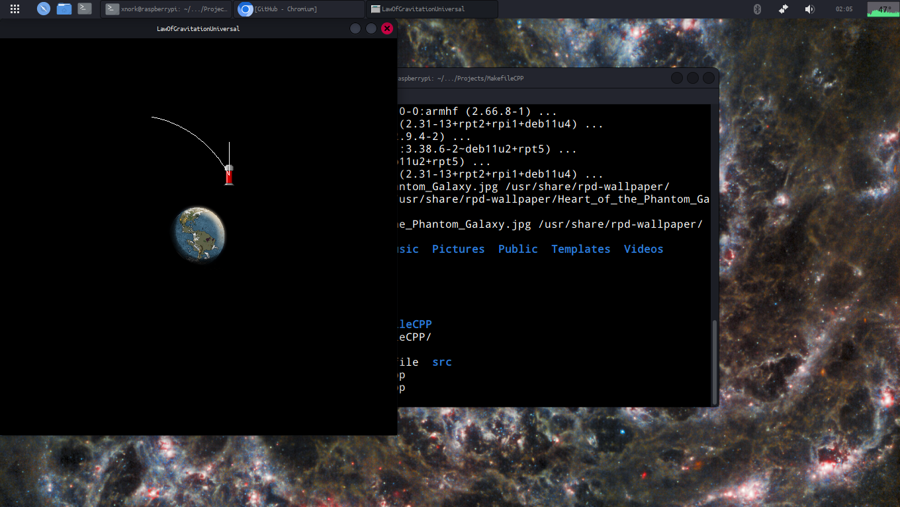
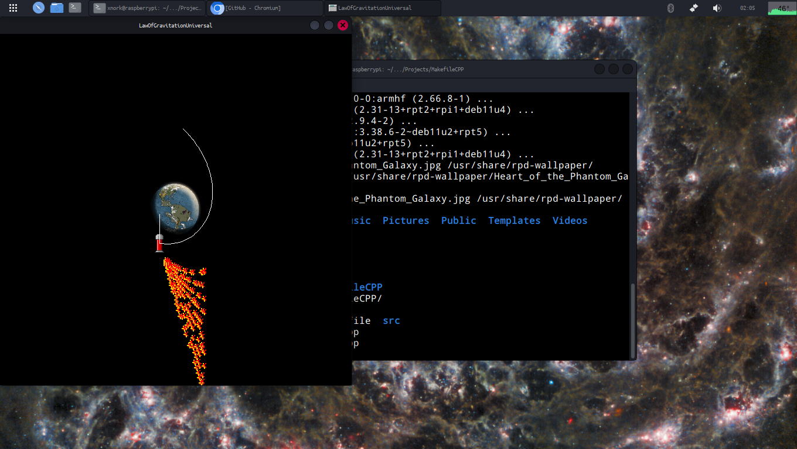

# RocketSimulator
## Warning!
My SDL is in the /opt/SDL folder. If yours is not in the same one, you must change the `LIBS` and `INCLUDE` flags in the Makefile, so that SDL2 is used.
## How to compile
Just write `make` in your terminal if you have `Makefile`.
## Images

